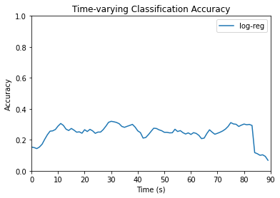

# HCP Logistic Regression
## Time Series Classification with ROI Features
Multinomial logistic regression was applied to the HCP dataset for 15-way time series classification of movie clips. Code can be found [here](hcp_logreg_indivtime.ipynb).

Dimensions of the data were used for the following purposes:
* Movie name - apply as label for classification
* ROI - use as features for classification
* Subject - split into training and testing sets
* Time point - categorize model results as time series of accuracies

### Dataset Creation
The dataset was transformed from a dictionary with movie clip names as keys and arrays of fMRI data as values (see [summary](hcp_summary.md)) to 2-dimensional arrays of X- and Y- train and test sets. Based on the findings from Misra et al., only the first 90 seconds, equivalent to the first 90 time points, were used. 

A 2-dimensional array was created containing data across all of the first 90 time points. Each row was designated for a different subject-movie clip combination. For 'testretest' cases, different runs from the same subject were also compiled as separate rows. Columns were designated for distinct ROIs. Thus, each array had 300 feature columns, in addition to a movie label column, a time point column, and a participant number column.

$
\begin{bmatrix}
ROI_{1} & ROI_{2} & \cdots & ROI_{300} & \text{movie} & \text{time} & \text{subj} \\
-2.3054726 & -1.6874946 & \cdots & -2.871706 & 'testretest' & 0 & 0 \\
-0.037214182 & 0.7795041 & \cdots & 1.4286939 & 'testretest' & 0 & 1 \\
\vdots & \vdots & \ddots & \vdots & \vdots & \vdots & \vdots \\
-0.29585192 & 0.38137275 & \cdots & -0.3323956 & 'starwars' & 89 & 175 \\
\end{bmatrix}
$

The data was split with 100 participants for training and 76 participants for testing. A list of participants used for the testing data set was randomly generated. Participant numbers within this list had corresponding ROI feature data stored in X_test and corresponding movie labels and time points stored in y_test. The same was done for participants not selected in the test set, except with X_train and y_train, respectively. All feature data in both training and testing sets was normalized using z-scores.

### Logistic Regression Model
A multinomial logistic regression model was created using the sci-kit learn library in Python. The model was fitted using the X_train set as input and the y_train set as output across all considered time points. Max_iters was set to 1000 and all other default parameter values were used. 

The model was then evaluated with the testing data at all 90 time points, and the accuracy was saved. Classification accuracy at each time point was plotted, as shown below:

---

