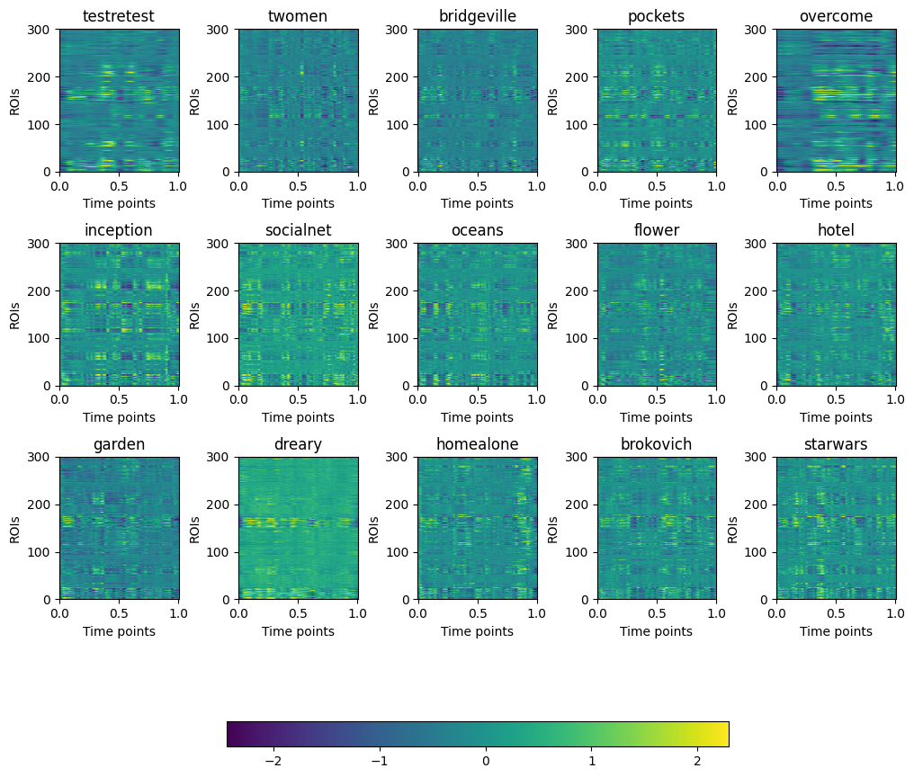

# HCP Dataset
## Overview
Visuals were created for better understanding of the HCP movie watching dataset. Loaded with pickle, the dataset is a dictionary with 15 movie-data array pairs. The movies included are:
* testretest
* twomen
* bridgeville
* pockets
* overcome
* inception
* socialnet
* oceans
* flower
* hotel
* garden
* dreary
* homealone
* brokovich
* starwars

All movie keys except 'testretest' are mapped to a 3 dimensional array with shape [# of participants, # of time points, # of ROIs].
The 'testretest' movie is mapped to a 4 dimensional array with shape [# of runs, # of participants, # of time points, # of ROIs] since 4 runs were done for each participant. The following values are constant for all 15 movies:
* number of participants: 176
* number of ROIs: 300

The number of time points varies between movies. Time points were normalized using maximums and minimums for comparison. For the figures created, individual participant responses at each (time point, ROI) were averaged to reduce the 3- or 4-dimensional array to a 2-dimensional array.

## 2D Raster

Raster graphics were created to show the change in fMRI data for the 15 movies. Normalized time points were represented on the x-axis and regions of interest were represented on the y-axis for each raster. Color was determined by the data value.

## Time Series Graphs

Line graphs were created to visualize change in values across time points. 

### Comparing ROIs

Data from the *Home Alone* movie was used. Three ROIs were randomly selected and the corresponding data was plotted, with time points on the x-axis and values on the y-axis. 

### Comparing Movies

The data corresponding to a randomly selected ROI for all 15 movies was plotted, with time points on the x-axis and values on the y-axis.

## ROIs

Line graphs were also created to visualize values at each ROI for certain time points. Data from the *Home Alone* movie was plotted, with ROIs on the x-axis and values on the y-axis.

A video was created for this purpose as well. The value for each region of interest was plotted, and the video format was used to simulate each time point.

<video src="homealone_vid.mp4" width=400px controls style="margin-left:20px">
</video>

## Resources
* [HCP Dataset Visualization Code](data.ipynb)
* [Celluloid Guide by Medium](https://medium.datadriveninvestor.com/how-to-create-animation-using-matplotlib-and-celluloid-70533ba013e8)
* [Matplotlib Docs](https://matplotlib.org/stable/api/axes_api.html)