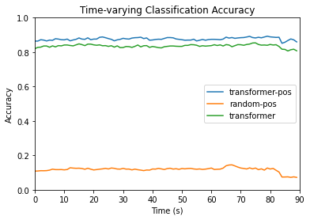

# Transformers Summary

A transformer was applied to the HCP dataset for 15-way time series classification of movie clips. 

Dimensions of the data were used for the following purposes:
* Movie name - apply as label for classification
* ROI - use as features for classification
* Subject - split into training and testing sets
* Time point - categorize model results as time series of accuracies

## Dataset Creation
The dataset was transformed from a dictionary with movie clip names as keys and arrays of fMRI data as values to 3-dimensional arrays of X- and Y- train and test sets. Only the first 90 seconds, equivalent to the first 90 time points, were used. 

The data was split with 100 participants for training and 76 participants for testing. A list of participants used for the testing data set was randomly generated. Participant numbers within this list had corresponding ROI feature data and movie labels stored in a testing dictionary. The same was done for participants not selected in the test set, except with a training dictionary. Dimensions for the values of these dictionaries were the same as the in the original dataset, except for 'testretest' cases, different runs from the same subject were also compiled as separate batches, converting 4 dimensions to 3.

For each dictionary, 3-dimensional arrays were created containing data across all of the first 90 time points. ROI input data was stored in an X_train or X_test array while movie labels were stored in a y_train or y_test array. ROI feature data was normalized with z-scores, and movie clip labels were one-hot encoded for each time step. Batches with less than 90 time steps were padded with 0.0. Thus, the X input sets had dimensions (batches, time steps = 90, features = 300) and the y label sets had dimensions (batches, time steps = 90, movie clips = 15).

The training datasets and testing datasets were wrapped into tensors to input into the model.

## Transformer Architecture
A transformer encoder block, consisting of a self-attention layer, concatenation and layer normalization, a feedforward layer, and concatenation and layer normalization, was implemented in PyTorch. The structure of the transformer encoder block is depicted below.

The initial model was created with 1 attention head and 1 layer of the transformer encoder block.

### Self-Attention
Self-attention is used to determine how two input vectors are related, based on the question at hand (i.e. classification). The operation is performed by taking in an n-dimensional $x_{i}$ vector and outputting an n-dimensional $y_{i}$ vector. In this case, $n=300$, the number of features, and $1 \le i \le 90$, the sequence length. The self-attention mechanism does not consider sequence order, as it performs a set-to-set transformation. 

The input vector $x_{i}$ is utilized for three purposes in the self-attention operation:
1. Query - compared to other vectors to establish weights for $y_{i}$
2. Key - compared to other vectors to establish weights for the output of vector $y_{j}$, where $j$ is a different time point
3. Value - used as part of a weighted sum to calculate the output vector

The $x_{i}$ vector is transformed using weight matrices $\boldsymbol W_{q}$, $\boldsymbol W_{k}$, and $\boldsymbol W_{v}$ to produce vectors $q_{i}$, $k_{i}$, and $v_{i}$:

$$
q_{i} = \boldsymbol W_{q} x_{i} \hspace{1cm}
k_{i} = \boldsymbol W_{k} x_{i} \hspace{1cm}
v_{i} = \boldsymbol W_{v} x_{i}
$$

Output vector $y_{i}$ is calculated using the following:

$$
y_{i} = \Sigma _{j=1} ^{k} w_{ij} x_{j}.
$$

$w_{ij}$ is not a parameter of the neural network, but determined from a dot product operation:

$$
w'_{ij} = q_{i} ^{T} k_{j}\newline
w_{ij} = softmax(w'_{ij})
$$

The self-attention operation is performed as part of the PyTorch TransformerEncoder class.

## Training and Evaluation
The model was fitted using the X_train set as input and the y_train set as output across all considered time points. The Adam optimizer and cross-entropy loss function were used in training. Learning rate was set to 0.001 and epochs were set to 50 for the single-head, single-layer transformer. Padded values were not masked.

The model was then evaluated with the testing data at all 90 time points. Accuracy for most time steps was around 83%. Classification accuracy at each time point was plotted.

### Random Inputs Testing
Random inputs based on the normal distribution were generated 20 times to fill the X_test dataset of dimensions (batches, time steps = 90, features = 300). The fitted transformer model was applied to each of the randomly generated datasets, and classification accuracy was calculated. The accuracy obtained from testing the model on the original dataset and the 90th percentile of accuracies obtained from random inputs were compared as time series:

## Multi-Head Attention
Multi-head attention was used to represent various relationships between values at different time points. In multi-head self-attention, several self-attention operations are performed in parallel, each with its query, key, and value transforms. The output vectors from these attention heads are concatenated and passed through a linear layer to reduce dimensions to the initial input size. To increase efficiency, each 300-dimensional feature input vector is split evenly among the heads. 

A transformer model with 4 attention heads and 6 layers of transformer encoder blocks was built, trained, and evaluated with test data and random inputs:

## Position Encoding
Since the basic self-attention operation treats input data as sets instead of sequences with specific orderings, position encoding was introduced to preserve time order. The position of each 300-dimensional input vector within the time sequence was mapped to a position vector and added to the original input vector for the model to interpret. The function utilized for position encoding was

$$
PE_{(pos, 2i)} = \sin (\frac {pos} {10000 ^ {2i / d_{model}}})
$$ 

$$
PE_{(pos, 2i+1)} = \cos (\frac {pos} {10000 ^ {2i / d_{model}}}).
$$

A single-head, single-layer transformer model with position encoding was implemented. Epochs were set to 20 and the learning rate was set to 0.001. Classification accuracies were compared between the two single-head attention models to determine the effect of position encoding.

A transformer model with 4 attention heads, 6 transformer encoder blocks, and position encoding was also created for comparison with the initial multi-head, multilayer transformer. In training, epochs were set to 50 and the learning rate was set to 0.0005.

## Resources
* [Transformers from Scratch](http://peterbloem.nl/blog/transformers)
* [The Illustrated Transformer](https://jalammar.github.io/illustrated-transformer/)
* [Attention and Transformers by Neuromatch](https://deeplearning.neuromatch.io/tutorials/W3D1_AttentionAndTransformers/student/W3D1_Tutorial1.html#implement-positionalencoding-function)